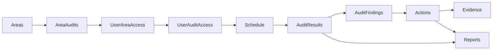

# BERT core compliance operating loop

This document defines the end-to-end compliance loop BERT implements on the company master Google Sheet. It complements `docs/roles-and-permissions.md` and `docs/production-launch-checklist.md`.

## Loop overview

1. **Provision** — Admin creates areas, maps audits to areas, grants user audit/area access, and schedules checks.
2. **Evaluate** — Auditor sees **Today / My Checks** when a schedule is due and access allows completion.
3. **Record** — Auditor completes and submits; rows append to **AuditResults** (and **AuditFindings** for failed answers).
4. **Action** — Failed answers auto-create **Actions**; managers assign, verify, and close with evidence.
5. **Report** — Report packs preview from live records and append to the **Reports** tab.

## Sheet tabs and definitions

| Tab | Purpose | Key fields |
|-----|---------|------------|
| **Areas** | Physical/logical sites auditors work in | `Area ID`, `Name`, `Status` |
| **AuditTemplates** | Canonical list of check templates | `Audit ID`, `Audit Name`, `Status`, `Default Frequency` |
| **AreaAudits** | Which templates run in which area | `Area ID`, `Audit ID`, `Status`, `Frequency Override` |
| **UserAreaAccess** | Area restriction assignments | `Email`, `Area ID`, `Access` |
| **UserAuditAccess** | Per-user audit permissions | `Email`, `Audit ID`, `Access` (`no_access`, `can_complete`, `full_access`) |
| **Schedule** | When checks become due | `Schedule ID`, `Area ID`, `Audit ID`, `Frequency`, `Next Due At`, `Assigned Role`, `Assigned User`, `Status` |
| **AuditResults** | Completed check submissions | `Result ID`, `Audit ID`, `Area ID`, `Completed By`, `Completed At`, `Status`, `Answers JSON` |
| **AuditFindings** | One row per failed/non-conforming answer | `Finding ID`, `Result ID`, `Question ID`, `Answer`, `Risk Level` |
| **Actions** | Corrective actions from findings | `Action ID`, `Source Audit ID`, `Source Question ID`, `Severity`, `Status`, `Assigned To Name` |
| **ActionComments** | Status change history on actions | `Comment ID`, `Action ID`, `From Status`, `To Status`, `Note` |
| **Evidence** | Photos/files linked to results, findings, or actions | `Evidence ID`, `Audit ID`, `Action ID`, `Finding ID`, `Local Ref`, `Drive Link` |
| **Reports** | Generated report pack history | `Report ID`, `Report Type`, `Title`, `Created By`, `Export Links` |
| **SyncLog** | Append-only sync audit trail | `Sync Item ID`, `Entity Type`, `Entity ID`, `Operation`, `Status` |

Tabs in `REQUIRED_TABS` (`src/schema/companySchema.ts`) are created/repaired via **Workspace repair**. Mapping tabs (`Areas`, `AuditTemplates`, `AreaAudits`, `UserAreaAccess`, `UserAuditAccess`) are ensured on repair via `ensureCompanyMappingTabs`.

## Schedule-driven due logic

- A check appears in **Today / My Checks** when:
  - User has audit access (`UserAuditAccess` + Forms & Checks matrix),
  - Area mapping allows it (`AreaAudits` when configured),
  - **Schedule** row exists with `Next Due At <= today` (or no schedule row exists for that audit/area),
  - Optional `Assigned Role` / `Assigned User` matches the signed-in user.
- Admins create schedules in **Schedules** (Master/Admin write; schedules control due visibility).
- Implementation: `src/utils/complianceSchedule.ts`, wired in `App.tsx` `assignedAudits`.

## Audit submission

On submit (`applyAuditSubmission` in `App.tsx`):

1. Builds sheet rows via `src/utils/auditSheetRows.ts`.
2. Creates local **Actions** for failed answers.
3. Queues `auditSubmission` sync item with full bundle payload.
4. Sync processor calls `POST /api/google-sheet-by-id/:sheetId/audit-bundle` via `src/services/complianceSyncService.ts`.

## Findings and actions

- Each failed / NC answer → **AuditFindings** row linked by `Result ID`.
- Matching **Action** auto-created with `Source Question ID` / severity from template metadata.
- Managers use **Actions** to assign, attach evidence, advance status, and close.

## Evidence

- Capture during audit (question photos) or on action close.
- Appends to **Evidence** tab; server uploads data-URL `Local Ref` values to company `04 Evidence` Drive folder when Google is connected.

## Reports

- In-app preview uses live audits, findings, actions, schedules, and history.
- Export queues `reportExport` sync → `POST .../reports` append.

## Roles (summary)

| Role | Loop participation |
|------|-------------------|
| **Master / Admin** | Full provision: areas, mapping, access, schedules |
| **Manager** | Actions, reports, team visibility; no area setup |
| **Auditor** | Today / My Checks, submit, simple post-submit message |

## API routes (loop-related)

| Route | Purpose |
|-------|---------|
| `GET/POST /api/company-areas/:masterSheetId` | Areas CRUD |
| `GET/PUT /api/company-audit-mapping/:masterSheetId/*` | Templates, area audits, access |
| `POST /api/google-sheet-by-id/:sheetId/schedules` | Schedule write |
| `POST .../audit-bundle` | Atomic result + findings + evidence + sync log |
| `POST .../actions` | Action tab sync |
| `POST .../reports` | Report history append |
| `POST .../repair` | Ensures all tabs including mapping tabs |

## Client modules

| Module | Role |
|--------|------|
| `src/utils/complianceSchedule.ts` | Due-date and assignment filtering |
| `src/utils/auditSheetRows.ts` | Sheet row builders + finding parse |
| `src/services/complianceSyncService.ts` | Google sync calls |
| `src/services/companyAreasService.ts` | Areas API |
| `src/services/companyAuditMappingService.ts` | Mapping API |

## QMS readiness (ISO 9001 support)

Lightweight quality registers and a management-review preview sit alongside the loop above — they **do not** duplicate Actions or NCRs. See [qms-readiness.md](./qms-readiness.md).

## Schema version

Current: **3.0.0** (`CURRENT_SCHEMA_VERSION` in `src/schema/companySchema.ts` and `server/server.mjs`).
